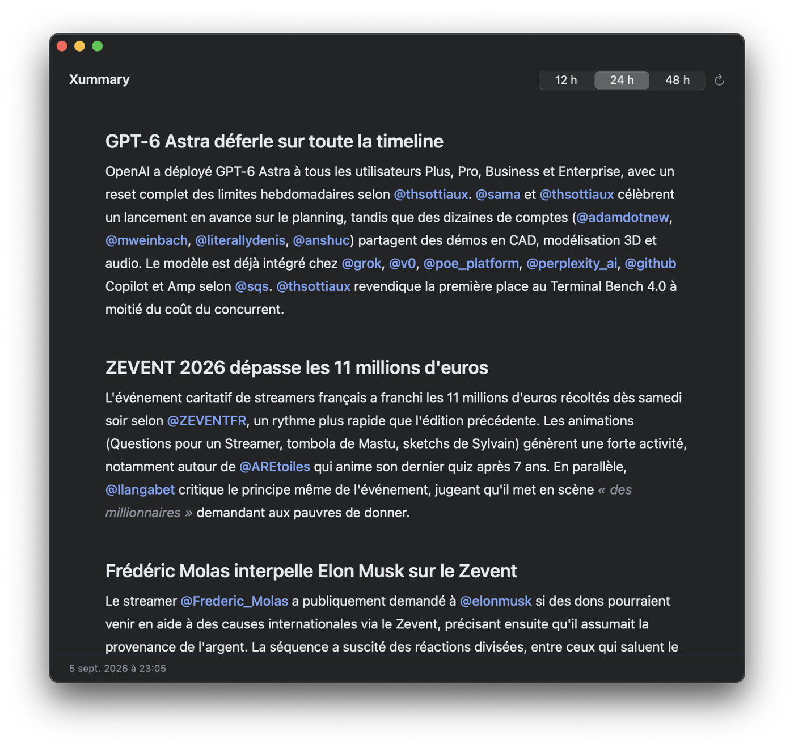

# xummary

**Your X timeline, read once a day instead of scrolled all day.**

`xummary` pulls a few pages of your **For You** and **Following** feeds, sends
them to Claude, and gives you one grouped briefing of what actually happened.
No feed, no infinite scroll, no rage bait — a page you read and close.

<p align="center">
  
</p>

Two front ends, one engine:

| | |
| --- | --- |
| [`cli/`](cli) | a Rust terminal app |
| [`macos/`](macos) | a SwiftUI window that runs the CLI and renders it |

## In the terminal

```
## ZEVENT 2026 occupe la timeline

Le ZEVENT domine la journée, entre extraits drôles et agacement.
@Palomarlena et @Tu_le_C relaient des séquences de stream, et
@FrenchRapUS annonce un maillot dédicacé par Messi.

## GPT-6 Astra et Perplexity

@perplexity_ai a mis GPT-6 Astra à disposition dans Perplexity
Computer pour les abonnés Pro et Max.

## Also

- un client Spotify natif a passé 3 200 étoiles GitHub, via @paolino
- @JLMelenchon revendique 12 000 personnes à la Braderie de Lille
```

## Install

You need [Rust](https://rustup.rs), the [`claude`
CLI](https://claude.com/claude-code) already logged in, and a Chromium-family
browser logged into x.com.

```sh
git clone https://github.com/kernoeb/xummary
cd xummary/cli
cargo build --release
rm -f ~/.local/bin/xummary          # replacing in place breaks the signature
cp target/release/xummary ~/.local/bin/
```

Then, for the macOS app:

```sh
cd ../macos
./build.sh
open Xummary.app
```

## Use

```sh
xummary                      # both feeds, 10 pages each, last 24 hours
xummary --hours 48
xummary --lang English       # the default is French
xummary --print              # plain stdout, pipe it anywhere
```

Full options in [`cli/README.md`](cli/README.md).

## How it works

1. **Session** — decrypts `auth_token` and `ct0` from your browser's cookie
   database. On macOS the AES key comes from the *"&lt;Browser&gt; Safe Storage"*
   keychain entry, so the first run asks for permission.
2. **Fetch** — calls X's web GraphQL API (`HomeTimeline` and
   `HomeLatestTimeline`) with the bearer token x.com ships to every browser.
3. **Filter** — drops anything older than `--hours`, dedupes across the two
   feeds, keeps the 600 most recent posts.
4. **Summarize** — pipes one compact line per post to `claude -p` and streams
   the answer back.

Both feeds are fetched at the same time, and paging stops as soon as a page
falls outside the window. Fetching takes about 8 seconds; the summary is the
rest, and varies. Every run ends by reporting its own breakdown — `600 posts ·
fetch 9s · wait 4s · total 41s` — where `wait` is the time to the first token.

It runs `claude` in an empty temporary directory with `--safe-mode`, so no
CLAUDE.md, skill, hook or MCP server from whatever repo you are standing in can
reach the briefing.

Reasoning effort defaults to **low** (`--effort`, `XUMMARY_EFFORT`). `claude`
defaults to `high`, which on a 600-post briefing spent 158 seconds thinking
before printing a single character — 188 s total against 39 s at `low`, for the
same eleven sections. `medium` measured the same as `low`. Raise it if you want
more accounts credited per section.

The default model is **Sonnet 5**. Opus is overkill for a summary. Haiku 4.5
was faster on small prompts but slower and vaguer on a full 600-post one in the
runs measured here. Override with `--model` or `XUMMARY_MODEL`.

One section per story: the prompt refuses to merge two unrelated events under
one heading, because a shared heading asserts a link that is not there.

The macOS app has no X code and no Claude code of its own. It runs
`xummary --print` and draws the result, so the parsing exists in one place.

## What it touches

Worth being plain about, since it reads your browser:

- it reads **your own** cookie database, for `auth_token` and `ct0` on x.com only
- it never writes those anywhere — no config file, no cache, no disk
- it is **read-only** against X: it never posts, likes, follows or blocks
- the posts it fetched go to Claude in the prompt, and nowhere else
- it uses your existing `claude` login, so there is no API key to hand it

## Limits

- X rate-limits the home timeline. Around 15 pages a run is comfortable.
- X rotates its GraphQL operation ids. If fetching starts returning 404, copy
  the fresh id out of a `graphql/<id>/HomeTimeline` request in devtools into
  `cli/src/x.rs`.
- Linux reads cookies only when the browser used the fallback password, not a
  desktop keyring.
- The macOS app is ad-hoc signed. Fine on your own machine, another Mac will
  refuse to open it.

## Thanks

The idea came from [unrager](https://github.com/guitaripod/unrager), a full
calm X client with a local-LLM rage filter. `xummary` shares no code with it
and does much less: one briefing, then you close the window.

## Licence

MIT. See [LICENSE](LICENSE).
